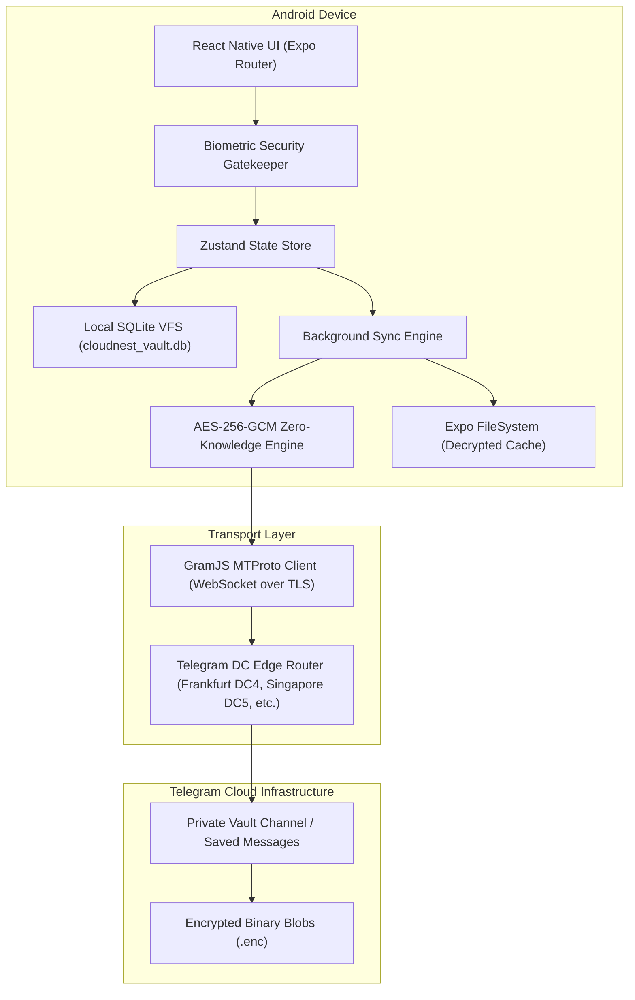

# CloudNest (Vault) 🛡️☁️

> **Zero-Knowledge Encrypted Cloud Storage powered by Telegram MTProto & SQLite VFS**  
> Built for Android with React Native (Expo SDK 57, React 19, Hermes Engine).

[](https://android.com)
[](https://reactnative.dev)
[](https://en.wikipedia.org/wiki/Galois/Counter_Mode)
[](https://core.telegram.org/mtproto)

---

## 🌟 Highlights

- **Zero-Knowledge Cryptography**: Files are encrypted and decrypted locally on-device using client-side **AES-256-GCM** with 16-byte authentication tags and SHA-256 integrity digests before leaving the device.
- **Telegram as Decentralized Object Store**: Uses Telegram's global data center network (DC1, DC2, DC4, DC5) as an encrypted object store via native MTProto WebSocket protocol with authentic DC migration support (`PHONE_MIGRATE_X`).
- **Authentic Authentication**: Real Telegram login with authentic phone code verification (supporting standard 5-digit and 6-digit Telegram codes), with zero simulated mockups or fake fallbacks.
- **Local SQLite Virtual File System (VFS)**: Offline-first architecture tracking folders, file metadata, encryption IVs, and upload states locally in SQLite.
- **LRU Cache & Auto-Eviction**: In-memory and disk-based LRU cache management that prioritizes favorites and cleans unneeded decrypted streams safely.
- **Biometric Security**: Hardware-backed biometric lock gatekeeper (Fingerprint / Face Unlock) protecting application launch and state restoration.
- **Modern Obsidian UI**: Beautiful dark-mode native interface adhering to Web Interface & Mobile design standards.

---

## 🏗️ Architecture Overview



---

## 📱 Features

1. **Authentication**: Real international phone number input with automatic formatting (+91 India default) and real Telegram login code verification.
2. **Dashboard & Storage Telemetry**: Real-time storage metrics, categorized breakdown (Documents, Media, Archives, Audio), and recent files.
3. **Folder Management**: Interactive cross-platform folder creation modal (`CreateFolderModal`) and nested folder navigation with breadcrumbs.
4. **File Operations**:
   - In-app preview for images, documents, and code files.
   - Inline file renaming modal (`RenameFileModal`).
   - Move files across virtual folders modal (`MoveFileModal`).
   - Soft deletion to Trash with 30-day auto-purge and permanent purge.
   - In-app sharing via Android system share sheet.
5. **Uploads Queue**: Live background sync processing files, computing SHA-256, encrypting via AES-256-GCM, and uploading with real progress telemetry.

---

## 🛠️ Tech Stack

- **Framework**: Expo SDK 57 / React Native 0.86 / React 19
- **JS Engine**: Hermes Bytecode Engine
- **State Management**: Zustand 5
- **Local Database**: `expo-sqlite`
- **Secure Key Storage**: `expo-secure-store`
- **File System**: `expo-file-system`
- **File Picking**: `expo-document-picker`, `expo-image-picker`
- **Telegram Client**: `telegram` (GramJS) with custom Hermes browser-shims
- **Icons**: `lucide-react-native`
- **Cryptography**: `crypto-browserify` (AES-256-GCM, PBKDF2, SHA-256)

---

## 🚀 Building & Testing Locally

### Prerequisites
- Node.js 18+
- Java 17 (JDK)
- Android SDK (API 34/35/36)
- Android physical device or Android Emulator

### Run Unit Tests
```bash
npm test
```
*Executes 37 unit tests covering LRU eviction, chunking, phone formatting, AES-256-GCM cryptography, mnemonic derivation, and MTProto routing.*

### Run Type Check
```bash
npx tsc --noEmit
```

### Build Production Release APK
```bash
cd android
.\gradlew.bat assembleRelease
```
The output APK is generated at:
`android/app/build/outputs/apk/release/app-release.apk`

---

## 📖 Complete Documentation & Wiki

For deep-dive architectural specifications, security models, Hermes polyfill resolutions, and step-by-step installation guides, see:
👉 **[WIKI.md](./WIKI.md)**

---

## 📄 License
MIT License.
